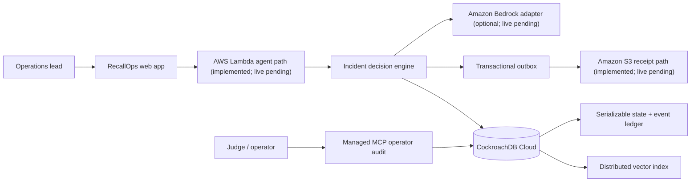

# RecallOps architecture

## Memory contract

Each accepted incident command writes these facts atomically:

1. the current incident projection and revision;
2. an application-append-only event with a previous-hash link;
3. a provenance-bearing semantic memory and embedding;
4. zero or more action proposals requiring explicit approval;
5. an outbox record for an AWS evidence receipt.

The response is derived only after commit. If the response is lost, replaying the same idempotency key returns the original aggregate and does not duplicate actions.

## Safety model

- Tenant scope and active lifecycle state are exact vector-index prefix columns; expiry is applied after an indexed candidate search.
- Retrieval excludes revoked or expired memories at query time; TTL later removes eligible rows.
- Action execution uses compare-and-set revision checks and records a compensating transition for undo.
- External side effects use an outbox and stable receipt key.
- Project-owned seed and evidence data are synthetic; the public UI requires visitors to confirm that they are entering synthetic demo data only.
- The public demo accepts only the configured synthetic tenant and enforces database-backed hourly quotas. This is an application boundary, not database row-level security. **Clear local view** changes only browser state, and the public API exposes no destructive reset route.
- Managed MCP audit uses a temporary cluster-scoped credential, while RecallOps enforces a client-side read-only allowlist and never calls tools outside that allowlist. The temporary key is deleted after evidence capture. This is a client boundary, not a claim that the credential or MCP server is intrinsically read-only.
- Bedrock output is accepted only when it matches a strict schema: one to three reversible, low/medium-risk proposals. No model output can mark an action executed.

## Failure model

- serialization failure: retry the whole transaction with bounded exponential backoff;
- ambiguous response after commit: reconcile by idempotency key;
- S3 unavailable: retain outbox record and retry without blocking the committed decision;
- embedding provider unavailable: use deterministic local embedding and mark provider in provenance;
- Bedrock unavailable or malformed: use the deterministic safety playbook and record the fallback in provenance;
- stale concurrent approval: reject with expected/actual revision evidence;
- revoked memory: retain tombstone and event history, remove it from future recommendations.
